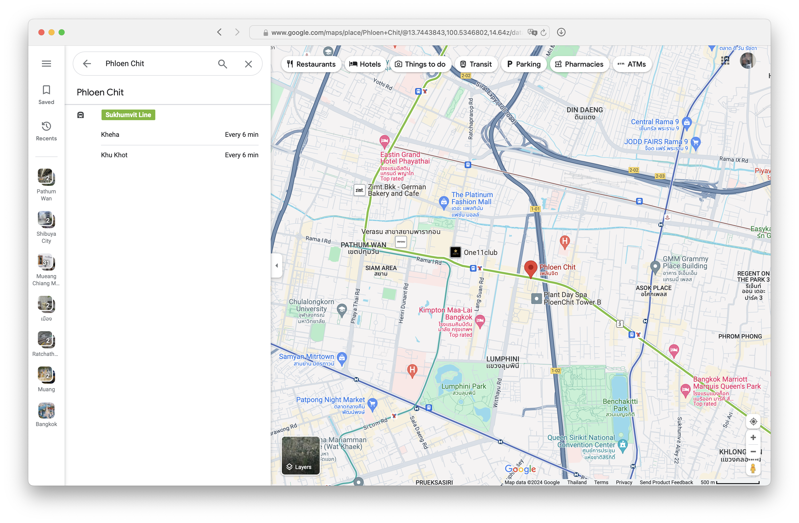
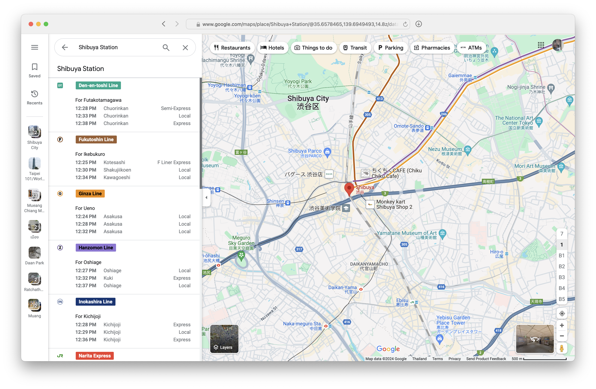

# Better Public Transport Information in Thailand

by Ruslan Doga and Rail Akhmetov

---

# Executive Summary

Our objective is to enhance the availability and accuracy of public transport information in Thailand by adopting modern standards like GTFS and GTFS-RT, similar to those implemented in Japan, Taiwan, and Singapore. Initially focusing on the BTS and MRT systems, we aim to extend these improvements to the entire Thai public transport network.

We plan to collaborate with Thai government agencies to integrate this system across all widely-used mapping applications, including Google Maps, Apple Maps, and OpenStreetMap. This integration will not only improve the convenience and efficiency of travel for tourists and residents alike but also reinforce Thailand's position as a leader in tourism and urban planning.

---

<!-- class: invert -->
<!-- backgroundColor: #191919-->
<!-- footer: ❤️ BTS -->

# tl;dr

We want to transform Google Maps in Bangkok from [this ...](https://www.google.com/maps/place/Phloen+Chit/@13.7484202,100.5365788,16z/data=!4m8!3m7!1s0x30e29edcfb15ae2b:0xb3f399fbdb9ddf6c!6m1!1v2!8m2!3d13.743044!4d100.548974!16s%2Fm%2F05f879r?entry=ttu)

---

<!-- footer: ❤️ Tokyo -->

... to something more like [this!](https://www.google.com/maps/place/Shibuya+Station/@35.6580339,139.7016358,17z/data=!3m1!5s0x60188b57f546295f:0x486cece41a7b21b0!4m8!3m7!1s0x60188b563b00109f:0x337328def1e2ab26!6m1!1v2!8m2!3d35.6580339!4d139.7016358!16zL20vMDIya3dq?entry=ttu)

---

<!-- class: default -->
<!-- footer: "" -->
<!-- backgroundColor: default -->

# What is GTFS?

The General Transit Feed Specification (GTFS) Schedule provides essential, static data for transit systems. This includes:

- **Routes and Stops:** Information on where to catch buses or trains.
- **Schedules and Frequencies:** Clear timetables to help plan trips.
- **Fares:** Upfront details on journey costs.
- **Flex Routes:** Options for demand-responsive transportation.

---

# What is GTFS-RT?

GTFS Realtime offers live updates on public transit, ensuring riders are always informed with:

- **Vehicle Locations:** Real-time tracking of buses and trains, so passengers know exactly where they are.
- **Arrival Times:** Accurate predictions to prevent missed connections.
- **Service Alerts:** Notifications about any service disruptions, allowing passengers to adjust their plans.

---

<!-- class: invert -->
<!-- backgroundColor: #191919-->

# GTFS in Action

The next few slides would show how GTFS data shows up on Google Maps in Tokyo.

---

Static GTFS Schedule shows this

---

Then GTFS-RT matches the scheduled time with real train location and shows its position together with the estimated arrival time.

---

If GTFS-RT reports that the train is running late Google Maps clearly shows that in the UI.

---

If GTFS-RT reports that the train is running late, then Google Maps clearly shows that in the UI.

---

Google Maps attempts to interpolate BTS timetable from [bts.co.th.](https://www.bts.co.th/eng/service/timetable.html)

---

<!-- class: default -->
<!-- backgroundColor: default -->

# Company

We plan to start a company with the mission to enhance public transport information in Thailand. Our focus will be on creating simple and effective solutions to improve the accuracy and availability of transport data.

---

# Mission

To provide accurate and accessible public transport information in Thailand through integration with all popular map apps, making it easier for people to use and rely on public transportation.

---

# Vision

A future where all map applications provides passengers with accurate, real-time public transport information, including train locations, timetables, fares, and delay updates. This will ensure that the online information matches the real-world excellence of the BTS system!

---

# Team

- Ruslan Doga: Co-Founder & CEO — responsible for overall product strategy and development. Background in Open-Source Software development for [Plausible Insights,](https://plausible.io) worked on Smart City project in Dornbirn, Austria.
- Rail Akhmetov: Co-Founder & CCO — responsible for commercial operations and strategic alliances. Background in investments at $30b conglomerate with assets across the metals and mining, telecoms, technology and internet sectors.

---

# Products

- [GTFS Data Management Platform](#gtfs-data-management-platform)
- [GTFS-RT Data Collection and Serving Platform](#gtfs-rt-data-collection-and-serving-platform)
- [(Optional) Mobile App for Bus Drivers](#optional-mobile-app)

---

# GTFS Data Management Platform

A simple and user-friendly platform tailored for Thai transit agencies to provide accurate public transport information for all popular map apps. Example of Google Maps:

1. Government officials use a website to enter and update their transport information.
1. The platform converts this data into a [GTFS Schedule archive.](https://gtfs.org/schedule/reference/)
1. [Google Transit](https://developers.google.com/transit) pulls the GTFS Schedule archive.
1. The schedule information is then displayed on [Google Maps](https://www.google.com/maps/about) as static data, including timetables, ticket fares, and more.

---

# GTFS-RT Data Collection and Serving Platform

A platform integrated with public transport operators to collect and provide real-time location data for all popular map apps. Example of Google Maps:

1. Real-time data, such as raw GPS data from BTS trains, is collected.
1. The platform transforms this data into a [GTFS-RT feed.](https://gtfs.org/realtime/reference/)
1. [Google Transit](https://developers.google.com/transit) pulls the GTFS-RT feed.
1. The real-time information is displayed on [Google Maps](https://www.google.com/maps/about) as dynamic data, including current train locations and estimated arrival times.

---

# (Optional) Mobile App

A potential Android app designed to collect real-time location data from buses that do not have built-in GPS.

1. Bus drivers install the Android app on their smartphones.
1. The app is manually activated when the bus is in operation.
1. The app collects real-time GPS data from the smartphone.
1. The app sends the GPS data to [the real-time platform.](#gtfs-rt-data-collection-and-serving-platform)
1. The real-time information is displayed on [Google Maps](https://www.google.com/maps/about) as dynamic data, including current bus locations and estimated arrival times.

---

# Innovation: Accurate Timetables

Our approach provides accurate, up-to-date timetables for map apps in Bangkok.

Currently, Google Maps (and other popular map apps) either shows BTS train departures as "every 6 min" (web) or interpolates them (iOS, Android), which is misleading. We ensure precise schedule information, improving user experience.

---

# Innovation: Real-Time Data

Currently, Google Maps (and other popular map apps) does not display real-time train locations, nor does it provide updates on delays or schedule accuracy. Our approach integrates real-time data for buses and trains, filling this gap with accurate, live information. This ensures users have up-to-date details on vehicle locations and any schedule changes.

---

# Other Innovations

- **User-Friendly Tools:** An intuitive website for officials and a mobile app for bus drivers to efficiently collect and manage GTFS data.

- **Seamless Map Apps Integration:** Ensures all data integrates smoothly with all popular map apps (Google Maps, Apple Maps, OpenStreetMap), enhancing user experience.

---

# Impacted Industry: Public Transport

Our project significantly impacts two key industries:

- - Improved Efficiency: By providing accurate and real-time data, we enhance the efficiency and reliability of public transport systems.
  - User Satisfaction: Passengers benefit from reliable information on schedules, real-time locations, and delays, leading to increased satisfaction and usage of public transport.
  - Operational Insights: Transport authorities can gain valuable insights from data analytics to optimize routes, schedules, and resource allocation.
- Tourism
  - Enhanced Experience: Tourists can easily navigate the public transport system with accurate, real-time information, making their travel experience smoother and more enjoyable.
  - Increased Accessibility: Better public transport information makes tourist attractions more accessible, encouraging more exploration and boosting local businesses.
  - Positive Perception: Reliable transport information improves the overall perception of Thailand as a modern, tourist-friendly destination.

---

# Competition

While there are existing transport information providers, this project's focus on real-time data integration and collaboration with government agencies sets it apart. It would offer a more comprehensive and user-friendly solution.

---

# Trends

Increasing urbanization and the need for sustainable transportation solutions are driving the demand for accurate and accessible transport information. Our platform aligns with these trends, offering timely and relevant solutions.

Additionally, Japan, Taiwan, and Singapore, countries that have successfully implemented GTFS-RT, serve as important models for our approach.

---

# Marketing Strategy

Our target customers are Thai government agencies initially, with plans to expand to other Southeast Asian countries. We will promote our platform through partnerships and demonstrations.

---

# Sales Strategy

We will engage government agencies through direct outreach, showcasing the benefits of our platform. For long-term growth, we will explore commercial opportunities with transport operators and other stakeholders.

---

# Financial Plan

Our platform will be entirely self-funded. We possess all the necessary resources and expertise to execute this project successfully without the need for external investors. This independence allows us to prioritize developments and make strategic decisions promptly and effectively.

---

# Exit Strategy

Potential exit opportunities include acquisition by a larger transport technology company or public offering.

---

# Funds Required

We will self-fund this project, ensuring we have all necessary resources for development, deployment, and initial operations. Our financial independence allows for complete control over the project timeline and decision-making, eliminating the need for external funding. This approach speeds up deployment and provides flexibility to adapt swiftly to project needs.

---

# Revenue Model

We will initiate our project with a free pilot program, focusing on delivering measurable results and showcasing the capabilities of our platform. Once established, our main revenue stream will transition to a licensing fee model. Our primary monetization strategy will involve offering our comprehensive data services to large businesses, including transport companies and FMCG industries. Additionally, we plan to expand our revenue by selling the platform to other countries.

---

# Growth Strategy

- **Phase 1:** Develop core platform, demonstrate real-time demo, and achieve Google Maps integration in Bangkok.
- **Phase 2:** Expand operations to other Thai cities and collaborate with the Ministry of Transport. Additionally, achieve integration with other popular mapping applications.
- **Phase 3:** Offer the platform as a paid service to other ASEAN countries and implement a business-to-business (B2B) strategy, selling our comprehensive data services to large enterprises, including transport companies and FMCG industries.

---

# Why Thailand?

We chose Thailand because it is a leading tourist destination, where robust public transport is essential for visitors unfamiliar with the area. The rapid growth of Thailand, especially Bangkok, highlights the increasing demand for efficient transit solutions. Our admiration for Bangkok's BTS system and our personal fondness for the country motivate us to enhance its digital transport infrastructure, improving the experience for tourists and residents.

---

# Thailand’s Benefit

- **Citizen Benefits:** Enhanced public transport reliability and information will lead to better travel decisions, increased usage, and potentially reduced road congestion and improved air quality.
- **Tourism Boost:** Accurate, real-time transit information simplifies navigation for tourists, enriching their experience and bolstering Thailand's image as a modern destination.
- **Government and Local Business Benefits:** Improved transport systems can aid the government in urban planning and traffic management, while local businesses benefit from increased accessibility and customer traffic, driving economic growth.