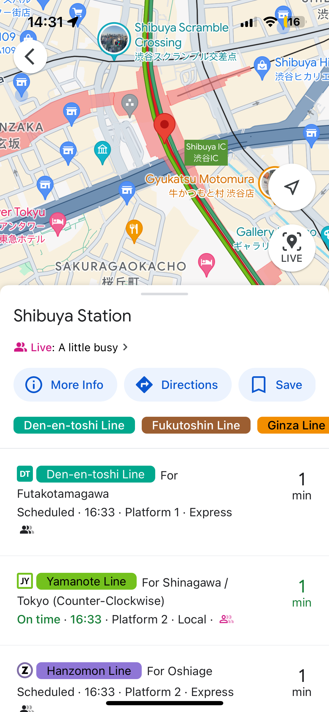
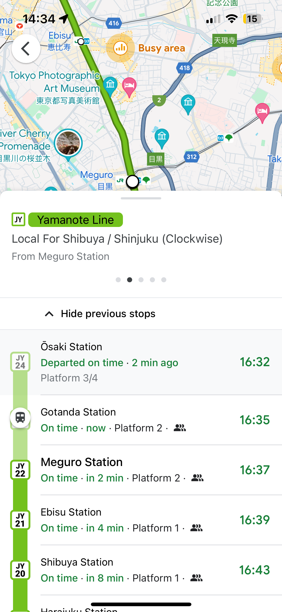
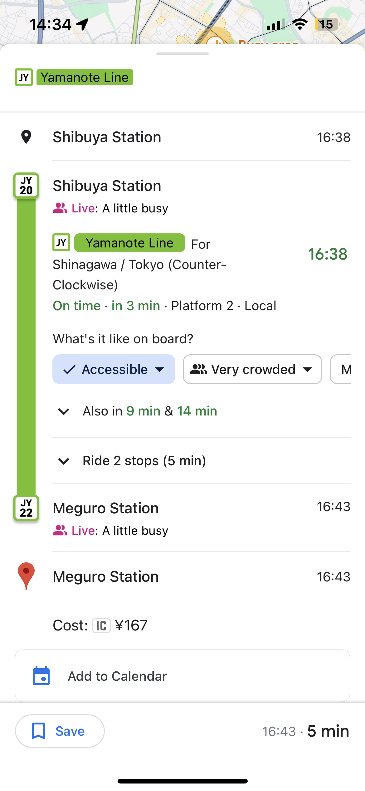
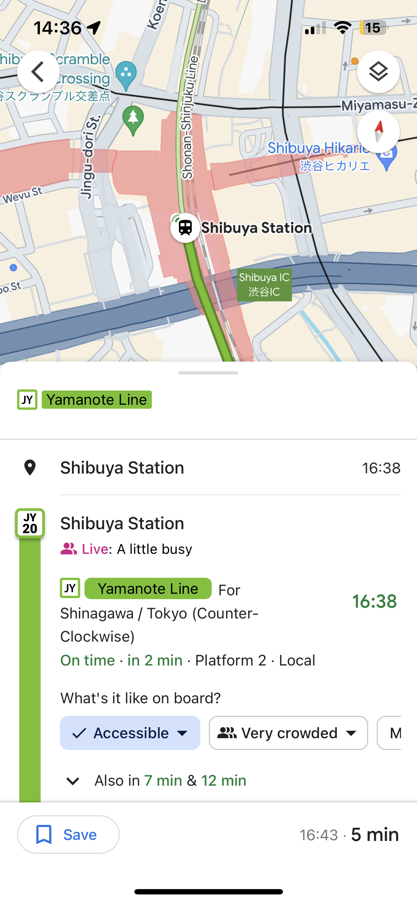
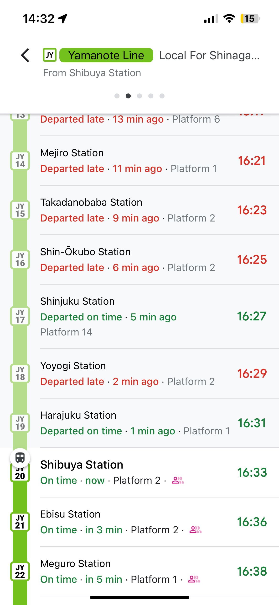
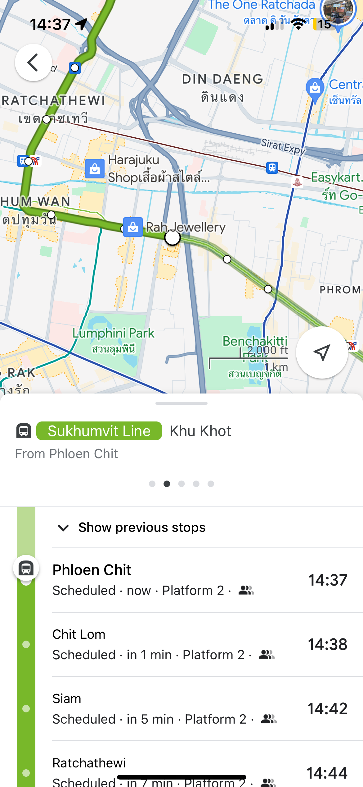

# Better Public Transport Information in Thailand

by Ruslan Doga and Rail Akhmetov

---

# Executive Summary

Our objective is to enhance the availability and accuracy of public transport information in Thailand by adopting modern standards like [GTFS](https://gtfs.org) and [GTFS-RT,](https://gtfs.org/realtime) as successfully implemented in Japan, Taiwan, and Singapore. Initially focusing on the BTS and MRT systems, we aim to extend these improvements to the entire Thai public transport network.

We plan to collaborate with Thai government agencies to integrate this system with Google Maps. This integration will not only improve the convenience and efficiency of travel for tourists and residents alike but also reinforce Thailand's position as a leader in tourism and urban planning.

---

<!-- class: invert -->
<!-- backgroundColor: #191919-->
<!-- footer: ❤️ BTS -->

# tl;dr

We want to transform Google Maps in Bangkok from [this ...](https://www.google.com/maps/place/Phloen+Chit/@13.7484202,100.5365788,16z/data=!4m8!3m7!1s0x30e29edcfb15ae2b:0xb3f399fbdb9ddf6c!6m1!1v2!8m2!3d13.743044!4d100.548974!16s%2Fm%2F05f879r?entry=ttu)

---

<!-- footer: ❤️ Tokyo -->

... to something more like [this!](https://www.google.com/maps/place/Shibuya+Station/@35.6580339,139.7016358,17z/data=!3m1!5s0x60188b57f546295f:0x486cece41a7b21b0!4m8!3m7!1s0x60188b563b00109f:0x337328def1e2ab26!6m1!1v2!8m2!3d35.6580339!4d139.7016358!16zL20vMDIya3dq?entry=ttu)

---

<!-- class: default -->
<!-- footer: "" -->
<!-- backgroundColor: default -->

# What is GTFS?

General Transit Feed Specification (GTFS) is a standardized format for public transport schedules and associated geographic information. It allows public transport data to be easily used in applications like Google Maps. It includes:

- [**Routes and Stops:**](#routes-and-stops) Information on where to catch buses or trains.
- [**Schedules and Frequencies:**](#schedules-and-frequencies) Clear timetables to help plan trips.
- [**Fares:**](#fares) Upfront details on journey costs.

---

<!-- class: invert -->
<!-- backgroundColor: #191919-->

# Routes and Stops

Information on where to catch buses or trains.

---

# Schedules and Frequencies

Clear timetables to help plan trips.

---

# Fares

Upfront details on journey costs.

---

<!-- class: default -->
<!-- footer: "" -->
<!-- backgroundColor: default -->

# What is GTFS-RT?

GTFS Realtime offers live updates on public transit, ensuring riders are always informed with:

- [**Vehicle Locations:**](#vehicle-locations) Real-time tracking of buses and trains, so passengers know exactly where they are.
- [**Arrival Times:**](#arrival-times) Accurate predictions to prevent missed connections.

---

<!-- class: invert -->
<!-- backgroundColor: #191919-->

# Vehicle Locations

GTFS-RT enhances schedules with real-time vehicle locations. It shows where the vehicle is and its estimated arrival time.

---

# Arrival Times

If the vehicle is late, GTFS-RT reports the delay. Google Maps clearly shows this in the user interface.

---

<!-- class: default -->
<!-- backgroundColor: default-->

# Google Maps in Bangkok

Google Maps in Bangkok are useful but have room for improvement. For example, BTS Skytrain has some GTFS data like station locations and fares. However, timetables are not yet included. Additionally, GTFS-RT data appears to be largely missing.

---

<!-- class: invert -->
<!-- backgroundColor: #191919-->

# Timetable Issues

Google Maps on iOS and Android tries to estimate the timetable from [rules](https://www.bts.co.th/eng/service/timetable.html) like ["every 6 minutes,"](#tldr) which can be misleading.

---

# Interpolated Location

Current train location is interpolated based on time. A quick way to identify it is to notice that the green "On Time" label is replaced with a gray "Scheduled" label.

---

<!-- class: default -->
<!-- backgroundColor: default -->

# Company

We plan to start a company with the mission to enhance public transport information in Thailand. Our focus will be on creating simple and effective solutions to improve the accuracy and availability of transport data.

---

# Mission

Our mission is to provide accurate and accessible public transport information in Thailand, making it easier for people to use and rely on public transportation.

---

# Vision

We envision a future where passengers have accurate, real-time public transport information, including vehicle locations, timetables, fares, and delays, with the quality of online information matching the real-world excellence of the BTS Skytrain system!

---

# Team

- Ruslan Doga: Co-Founder & CEO — responsible for overall product strategy and development. Background in Open-Source Software development for [plausible.io.](https://plausible.io)
- Rail Akhmetov: Co-Founder & CCO — responsible for commercial operations and strategic alliances. Background in investments at $30b conglomerate with assets across the metals and mining, telecoms, technology and internet sectors.

---

<!-- class: invert -->
<!-- backgroundColor: #191919-->

# Collaboration and Support

For complete success, collaboration is essential.

We plan to work closely with Bangkok Mass Transit System (BTS), Mass Rapid Transit Authority of Thailand (MRT), and the Ministry of Transport to integrate our system with their existing infrastructure, ensuring accurate and up-to-date public transport information.

For example, we would need access to real-time location data from BTS and MRT trains and we would require formal authorization from the Department of Land Transport when applying for the Google Transit program, confirming that we are acting on their behalf.

---

<!-- class: default -->
<!-- backgroundColor: default -->

# Products

- [GTFS Data Management Platform](#gtfs-data-management-platform)
- [GTFS-RT Data Collection and Serving Platform](#gtfs-rt-data-collection-and-serving-platform)
- [(Optional) Mobile App for Bus Drivers](#optional-mobile-app)

---

# GTFS Data Management Platform

A simple and user-friendly platform tailored for Thai transit agencies to develop and maintain accurate public transport information as GTFS.

1. **Data Entry and Updates:** Government officials use our website to enter or update their transport information with ease.
2. **Data Conversion:** The platform converts this data into a [GTFS Schedule.](https://gtfs.org/schedule/reference/)
3. **Submission to Google Transit:** This GTFS Schedule can then be submitted to [Google Transit.](https://developers.google.com/transit) Once accepted, the updated information is displayed on Google Maps as static data, including routes, timetables, ticket fares, and more.

---

# GTFS-RT Data Collection and Serving Platform

A platform integrated with public transport operators to collect and transform real-time location data into GTFS-RT.

1. **Access to Real-Time GPS Data:** Public transport operators, like [bts.co.th,](https://bts.co.th) provide access to real-time GPS data from their vehicles.
2. **Data Transformation:** The platform ingests this data and converts it into [GTFS-RT.](https://gtfs.org/realtime/reference/)
3. **Publishing to Google Transit:** This GTFS-RT Feed can then be published to [Google Transit.](https://developers.google.com/transit) Once accepted, the real-time information will be displayed on Google Maps, showing current vehicle locations and estimated arrival times.

---

# (Optional) Mobile App

A potential Android app designed to collect real-time location data from buses without built-in GPS.

1. **Installation:** Bus drivers install our Android app on their smartphones.
1. **Activation:** The app is manually activated when the bus is in operation.
1. **Data Collection:** The app collects real-time GPS data from the smartphone.
1. **Data Transmission:** The app sends the GPS data to [the real-time platform.](#gtfs-rt-data-collection-and-serving-platform)
1. **Dynamic Display:** The real-time information is displayed on [Google Maps](https://www.google.com/maps/about) as dynamic data, including current bus locations and estimated arrival times.

---

<!-- class: invert -->
<!-- backgroundColor: #191919-->

# Why Focus on Google Maps?

- **Widespread Use:** Google Maps is extensively used by both locals and tourists, ensuring broad access to public transport information.

- **High Return for Low Effort:** Google Maps already has the infrastructure for displaying transit data. We just need to provide the data, making it a highly efficient solution.

---

<!-- class: default -->
<!-- backgroundColor: default -->

# Innovation: Accurate Timetables

Our approach delivers precise, up-to-date public transport timetables using the widely recognized GTFS Schedule standard.

Currently, Google Maps shows BTS train departures as ["every 6 minutes"](https://www.google.com/maps/place/Phloen+Chit/@13.7484202,100.5365788,16z/data=!4m8!3m7!1s0x30e29edcfb15ae2b:0xb3f399fbdb9ddf6c!6m1!1v2!8m2!3d13.743044!4d100.548974!16s%2Fm%2F05f879r?entry=ttu) or estimates them on iOS and Android, which can lead to inaccuracies. This indicates that the GTFS data provided is incomplete and could be significantly improved.

---

# Innovation: Real-Time Data

Our approach collects real-time data from buses and trains and provides it as GTFS-RT.

Currently, Google Maps does not display real-time BTS train locations or provide updates on delays and schedule accuracy. This indicates a lack of GTFS-RT data in Thailand.

By implementing GTFS-RT, we aim to fill this gap, providing accurate, live information that enhances the user experience with up-to-date vehicle locations and schedule changes.

---

# Other Innovations

- **User-Friendly Tools:** An intuitive website for officials and a mobile app for bus drivers to efficiently collect and manage GTFS data.

- **GTFS Data Availability:** We will make GTFS data easily accessible, ensuring it can integrate with any platform that supports this standard.

- **Optimized for Google Maps:** We will take extra steps to ensure seamless integration with Google Maps due to its widespread use.

---

# Impacted Industries

This project impacts [the public transport](#impacted-industry-public-transport) and [tourism](#impatced-industry-tourism) industries.

---

# Impacted Industry: Public Transport

- **Improved Efficiency:** By providing accurate and real-time data, we enhance the efficiency and reliability of public transport systems.
- **User Satisfaction:** Passengers benefit from reliable information on schedules, real-time locations, and delays, leading to increased satisfaction and usage of public transport.

---

# Impatced Industry: Tourism

- **Enhanced Experience:** Tourists can easily navigate the public transport system with accurate, real-time information, making their travel experience smoother and more enjoyable.
- **Positive Perception:** Reliable transport information improves the overall perception of Thailand as a modern, tourist-friendly destination.

---

# Competition

While there are existing transport information providers, this project's focus on real-time data integration and collaboration with government agencies sets it apart. It would offer a more comprehensive and user-friendly solution.

---

# Trends

Increasing urbanization and the need for sustainable transportation solutions are driving the demand for accurate and accessible transport information. Our platform aligns with these trends, offering timely and relevant solutions.

Additionally, Japan, Taiwan, and Singapore, countries that have successfully implemented GTFS-RT, serve as important models for our approach.

---

# Marketing Strategy

Our target customers are Thai government agencies initially, with plans to expand to other Southeast Asian countries. We will promote our platform through partnerships and demonstrations.

---

# Sales Strategy

We will engage government agencies through direct outreach, showcasing the benefits of our platform. For long-term growth, we will explore commercial opportunities with transport operators and other stakeholders.

---

# Financial Plan

Our platform will be entirely self-funded. We possess all the necessary resources and expertise to execute this project successfully without the need for external investors. This independence allows us to prioritize developments and make strategic decisions promptly and effectively.

---

# Exit Strategy

Potential exit opportunities include acquisition by a larger transport technology company or public offering.

---

# Funds Required

We will self-fund this project, ensuring we have all necessary resources for development, deployment, and initial operations.

Our financial independence allows for complete control over the project timeline and decision-making, eliminating the need for external funding. This approach speeds up deployment and provides flexibility to adapt swiftly to project needs.

---

# Revenue Model

We will initiate our project with a free pilot program, focusing on delivering measurable results and showcasing the capabilities of our platform. Once established, our main revenue stream will transition to a licensing fee model. Additionally, we plan to expand our revenue by selling the platform to other countries.

---

# Growth Strategy

- **Phase 1:** Develop core platform, demonstrate real-time demo, and achieve a more complete Google Maps integration in Bangkok.
- **Phase 2:** Expand operations to other Thai cities and collaborate with the Ministry of Transport. Additionally, provide support for integration with other popular mapping applications.
- **Phase 3:** Offer the platform as a paid service to other ASEAN countries.

---

# Why Thailand?

We chose Thailand because it is a leading tourist destination and robust public transport information is essential for visitors unfamiliar with the area. The rapid growth of Thailand, especially Bangkok, highlights the increasing demand for efficient transit solutions.

Our admiration for Bangkok's BTS Skytrain system and our personal fondness for the country motivate us to enhance its digital transport infrastructure, improving the experience for tourists and residents.

---

# Thailand’s Benefit

- **Enhanced Accessibility:** Real-time information on Google Maps empowers users to plan trips more efficiently, reducing wait times and improving overall public transport usability.

- **Increased Ridership:** Clear and reliable information can encourage more people to use public transport, potentially reducing traffic congestion and emissions.

- **Positive Impact on Tourism:** Improved navigation tools for public transport benefit both residents and tourists, enhancing the overall visitor experience and bolstering Thailand's image as a modern destination.
